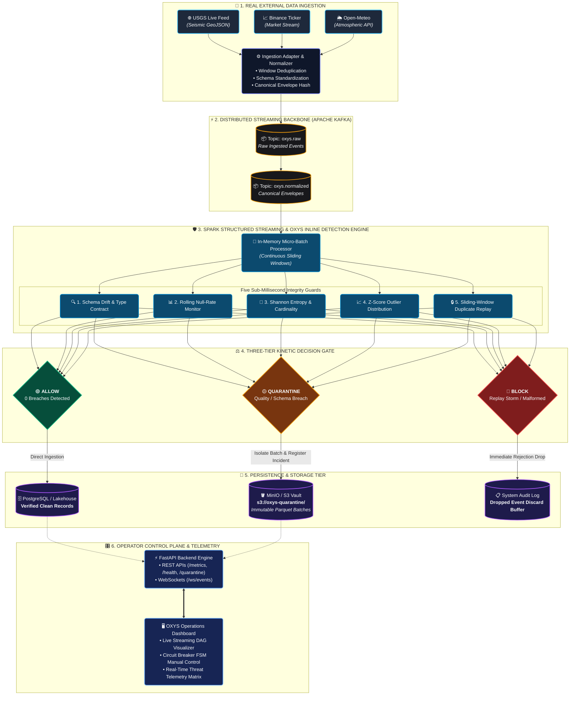
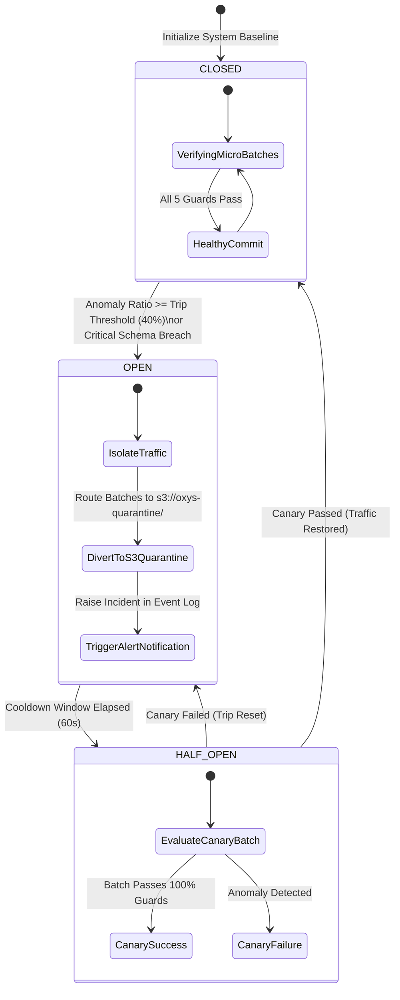

# OXYS

> **Domain-Agnostic Real-Time Streaming Data Integrity and Anomaly Protection Engine.**  
> OXYS provides inline streaming assertions across distributed messaging backbones, isolating schema drift, null-rate spikes, cardinality collapse, and duplicate replay storms before bad data contaminates downstream lakehouses and analytics systems.

[](tests/)
[](https://python.org)
[](https://fastapi.tiangolo.com)
[](https://kafka.apache.org/)
[](https://spark.apache.org/)
[](https://www.postgresql.org/)
[](https://min.io/)
[](LICENSE)

---

## Table of Contents

- [1. Technical Overview](#1-technical-overview)
- [2. Key Features](#2-key-features)
- [3. Architecture & Data Flow](#3-architecture--data-flow)
- [4. Ingestion & Canonical Event Format](#4-ingestion--canonical-event-format)
- [5. Stream Quality & Integrity Guards](#5-stream-quality--integrity-guards)
- [6. Kinetic Circuit Breaker FSM](#6-kinetic-circuit-breaker-fsm)
- [7. Quickstart & Installation](#7-quickstart--installation)
- [8. Configuration & Environment Variables](#8-configuration--environment-variables)
- [9. API Reference & Control Plane](#9-api-reference--control-plane)
- [10. Testing & Controlled Chaos Verification](#10-testing--controlled-chaos-verification)
- [11. Contributing](#11-contributing)
- [12. Roadmap](#12-roadmap)
- [13. License](#13-license)

---

## 1. Technical Overview

In event-driven stream architectures, unvalidated upstream bugs—such as silent serialization errors, unannounced schema drift, corrupted null spikes, or retry storms—cascade downstream unchecked. Traditional validation approaches rely on batch post-mortems after databases and data lakes have already been corrupted.

**OXYS** functions as an inline data firewall between streaming logs (e.g. Apache Kafka) and storage sinks (PostgreSQL, MinIO S3, Apache Iceberg, Delta Lake). Every incoming micro-batch is evaluated in real time against strict schema contracts, statistical distribution baselines, and entropy invariants. When an integrity breach occurs, OXYS dynamically routes bad records to a quarantined dead-letter vault while preserving continuous healthy stream processing.

---

## 2. Key Features

- **Domain-Agnostic Real Stream Ingestion**: Ships with live telemetry adapters (USGS Earthquake Hazards Program GeoJSON Feed, Binance Crypto Market Stream, and Open-Meteo Planetary Sensor Stream) with continuous background deduplication and deterministic envelope normalization.
- **5 Sub-Millisecond Integrity Guards**:
  - *Schema Drift Guard*: Enforces type contracts and flags undeclared mutations.
  - *Null-Rate Guard*: Monitors rolling null frequencies against configurable thresholds.
  - *Cardinality / Shannon Entropy Guard*: Detects key collapse or loss of diversity across partition keys.
  - *Distribution / Z-Score Outlier Guard*: Detects numerical anomalies against rolling baselines.
  - *Duplicate Replay Guard*: Sliding-window deduplication on deterministic event IDs.
- **Three-Tier Kinetic Circuit Breaker**:
  - `ALLOW`: Commits validated records directly to lakehouse and database sinks.
  - `QUARANTINE`: Isolates anomalous batches to immutable MinIO S3 vaults (`s3://oxys-quarantine/`) and logs structured incidents.
  - `BLOCK`: Drops replay storms and unrecoverable malformed binary payloads immediately.
- **Zero Mock Fallback Execution**: Embedded socket probes detect Kafka/MinIO brokers in `< 0.2s` and seamlessly operate standalone via in-memory streaming queues and SQLite/PostgreSQL storage.
- **Operator Console & Control Plane**: Full FastAPI REST API, live WebSockets (`/ws/events`), and a retro terminal UI.

---

## 3. Architecture & Data Flow



---

## 4. Ingestion & Canonical Event Format

All external streams are ingested, deduplicated, and mapped into a domain-agnostic `NormalizedEvent` envelope before publishing to Kafka:

```json
{
  "event_id": "usgs_ak024251g8s",
  "source": "usgs",
  "event_timestamp": "2026-09-19T11:43:39.386000+00:00",
  "ingestion_timestamp": "2026-09-19T11:43:40.120000+00:00",
  "schema_version": "v1.0.0",
  "payload": {
    "magnitude": 1.4,
    "place": "26 km NNE of Karluk, Alaska",
    "longitude": -154.303,
    "latitude": 57.788,
    "depth": 57.3,
    "mag_type": "ml",
    "status": "automatic",
    "tsunami": 0,
    "significance": 30
  }
}
```

### Event ID Hashing Policy
- **Deterministic Streams**: Hash computed as `SHA-256(source + payload_json + event_timestamp)` ensuring idempotency across re-deliveries.
- **USGS Real-Time Stream**: Prefixed stable feature identifier `usgs_{feature_id}`. Unchanged features are deduplicated in memory; updated features with newer timestamps propagate immediately.

---

## 5. Stream Quality & Integrity Guards

OXYS evaluates 5 continuous mathematical and structural guards per micro-batch:

| Guard | Identifier | Metric & Algorithm | Failure Threshold | Action |
| :--- | :--- | :--- | :--- | :--- |
| **Schema Integrity** | `schema` | Type assertions against registered schema registry | $> 0$ type errors | `QUARANTINE` |
| **Null Rate** | `null_rate` | Rolling average null field frequency over $N$ batches | $> 15.00\%$ null fields | `QUARANTINE` |
| **Cardinality** | `cardinality` | Normalized Shannon entropy: $H = -\sum p_i \log_2 p_i$ | $< 0.40$ entropy | `QUARANTINE` |
| **Distribution** | `distribution` | Standard deviation Z-score: $Z = \frac{|x - \mu|}{\sigma}$ | $Z > 3.50$ | `QUARANTINE` |
| **Event Integrity** | `integrity` | Sliding deduplication set over 1,000 recent event IDs | $\ge 1$ duplicate replayed | `BLOCK` |

---

## 6. Kinetic Circuit Breaker FSM

The Circuit Breaker enforces strict containment states:



1. **`CLOSED`**: Micro-batches pass all guard invariants; data commits to primary lakehouse and database.
2. **`OPEN`**: Threshold breached; anomalous batch is diverted to `s3://oxys-quarantine/` and an incident is declared.
3. **`HALF-OPEN`**: Cooldown window expires; canary micro-batch is evaluated. If valid, state returns to `CLOSED`.

---

## 7. Quickstart & Installation

### 7.1 Prerequisites

- **Python**: `3.11+`
- **Docker & Docker Compose** (Optional, for running Apache Kafka and MinIO services locally)

### 7.2 Local Setup

```bash
# 1. Clone repository
git clone https://github.com/Sivasakthi-Vengatesan/oxys.git
cd oxys

# 2. Create and activate virtual environment
python -m venv venv
# On Windows:
.\venv\Scripts\activate
# On Linux/macOS:
source venv/bin/activate

# 3. Install dependencies
pip install -r requirements.txt

# 4. Configure environment variables
cp .env.example .env

# 5. Start the local server
python -m uvicorn server.main:app --host 0.0.0.0 --port 8000
```

### 7.3 Docker Compose Setup (Full Stack)

```bash
# Launch Kafka, Zookeeper, PostgreSQL, MinIO, and OXYS Engine
docker-compose up -d
```

### 7.4 Verification

```bash
# Verify health endpoint
curl -s http://localhost:8000/health | jq .

# Verify streaming metrics
curl -s http://localhost:8000/metrics | jq .
```

Access the **OXYS Operator Console** at [http://localhost:8000/app.html](http://localhost:8000/app.html).

---

## 8. Configuration & Environment Variables

| Variable | Description | Default | Required |
| :--- | :--- | :--- | :--- |
| `HOST` | Server bind host address | `0.0.0.0` | No |
| `PORT` | Server bind port | `8000` | No |
| `LOG_LEVEL` | Python logging severity level | `info` | No |
| `USGS_FEED_URL` | Live USGS GeoJSON feed endpoint | `https://earthquake.usgs.gov/.../all_hour.geojson` | No |
| `USGS_POLL_INTERVAL_SECONDS` | USGS feed polling interval in seconds | `60` | No |
| `KAFKA_BOOTSTRAP_SERVERS` | Kafka broker connection string | `localhost:9092` | No |
| `KAFKA_RAW_TOPIC` | Kafka topic for raw ingested payloads | `oxys.raw` | No |
| `KAFKA_NORMALIZED_TOPIC` | Kafka topic for normalized envelopes | `oxys.normalized` | No |
| `KAFKA_QUARANTINE_TOPIC` | Kafka dead-letter topic | `oxys.quarantine` | No |
| `DATABASE_URL` | Database connection string (PostgreSQL or SQLite) | `sqlite:///./oxys.db` | No |
| `MINIO_ENDPOINT` | MinIO / S3 Object Storage endpoint | `localhost:9000` | No |
| `MINIO_ACCESS_KEY` | S3 Access Key | `minioadmin` | No |
| `MINIO_SECRET_KEY` | S3 Secret Key | `minioadmin` | No |
| `MINIO_QUARANTINE_BUCKET`| S3 Bucket for isolated quarantine batches | `oxys-quarantine` | No |
| `NULL_RATE_THRESHOLD` | Maximum tolerated percentage of null fields | `15.00` | No |
| `CARDINALITY_MIN_THRESHOLD` | Minimum Shannon entropy for partition keys | `0.40` | No |
| `DISTRIBUTION_Z_THRESHOLD` | Maximum standard deviation Z-score for metrics | `3.50` | No |

---

## 9. API Reference & Control Plane

### Core Endpoints

#### `GET /health`
Returns service liveness, circuit breaker status, and storage connectivity.
```json
{
  "status": "HEALTHY",
  "system_status": "ONLINE",
  "database": "CONNECTED",
  "storage": "CONNECTED",
  "circuit_breaker": "CLOSED",
  "timestamp": "2026-09-19T12:00:00.000Z"
}
```

#### `GET /metrics`
Returns real-time processing statistics and calculated streaming null rates.
```json
{
  "events_processed": 157000,
  "events_allowed": 156820,
  "events_quarantined": 180,
  "events_blocked": 0,
  "anomaly_count": 180,
  "null_rate_pct": 0.0,
  "cardinality_entropy": 0.88,
  "circuit_state": "CLOSED",
  "pipeline_health": "OPTIMAL"
}
```

#### `GET /events?limit=50`
Fetches verified streaming records persisted to the database.

#### `GET /schema`
Returns the expected schema baseline and active validation policies.

#### `GET /api/quarantine`
Returns all isolated dead-letter batches stored in `s3://oxys-quarantine/` with diagnostic metadata.

#### `POST /api/circuit/{action}`
Controls circuit state (`trip`, `reset`, `half-open`).

---

## 10. Testing & Controlled Chaos Verification

The project includes an automated test suite verifying data source normalization, detector mathematics, storage persistence, and fault injection.

```bash
# Run complete test suite (33 tests)
python -m pytest tests/ -v
```

### Live USGS End-to-End Pipeline Trace
Execute the real-world end-to-end verification script:
```bash
python verify_usgs_live.py
```

Output trace:
```text
[STEP 1] Fetching live data from USGS GeoJSON Feed...
-> Successfully ingested and normalized 14 earthquake features from USGS.
-> Sample Event ID: usgs_aka2026sozelf
-> Payload: {"magnitude": 1.4, "place": "26 km NNE of Karluk, Alaska", "longitude": -154.303, "latitude": 57.788, "depth": 57.3}

[STEP 2] Dispatching to Kafka Producer (oxys.raw)...
-> Target Topic: oxys.normalized

[STEP 3] Executing OXYS Stream Processor & Detection Guards...
-> Spark Batch ID: #00483
-> OXYS Decision: ALLOW
-> Circuit Breaker State: CLOSED

[STEP 4] Verifying PostgreSQL / SQLite Database Record...
-> Database Event Found by ID (usgs_aka2026sozelf): True

[STEP 5] Querying FastAPI Endpoints...
-> GET /health: status=HEALTHY, circuit=CLOSED
-> GET /metrics: events_processed=2361, null_rate=0.0%

[STEP 6] Executing Controlled Dev-Only Fault Injections...
   [6.1] Schema Drift Injection -> Decision=QUARANTINE, Circuit=OPEN
   [6.2] Duplicate Replay Storm -> Decision=BLOCK
```

---

## 11. Contributing

1. Fork the repository (`https://github.com/Sivasakthi-Vengatesan/oxys`).
2. Create a feature branch (`git checkout -b feature/streaming-guard-custom`).
3. Commit your changes with clear messages (`git commit -m 'feat: add streaming histogram drift guard'`).
4. Ensure all tests pass (`python -m pytest tests/ -v`).
5. Push to the branch (`git push origin feature/streaming-guard-custom`) and open a Pull Request.

---

## 12. Roadmap

- [x] Dedicated USGS Real-Time Earthquake GeoJSON Feed Ingestion.
- [x] Kinetic Circuit Breaker finite-state machine with MinIO S3 dead-letter vaulting.
- [x] Inline statistical guards (Schema, Null Rate, Shannon Entropy, Z-Score, Dedup).
- [ ] Apache Iceberg and Delta Lake native sink connectors.
- [ ] Prometheus metrics export endpoint (`/metrics/prometheus`).
- [ ] Distributed eBPF network packet loss and latency telemetry probe integration.

---

## 13. License

Distributed under the MIT License. See `LICENSE` for more information.
